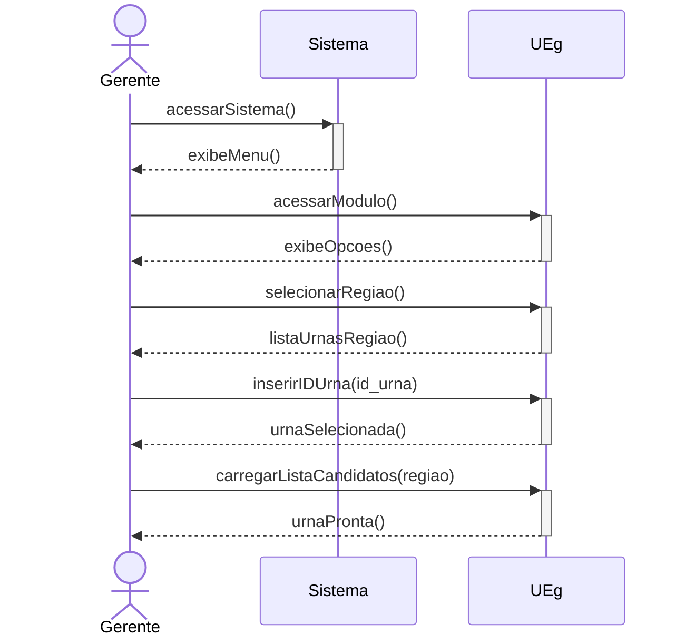
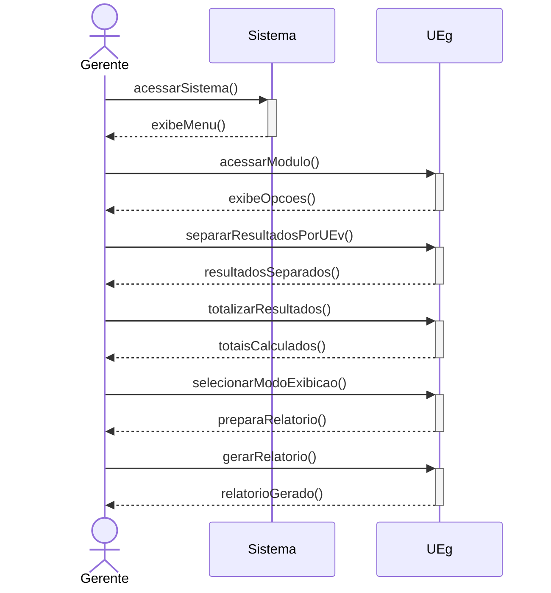
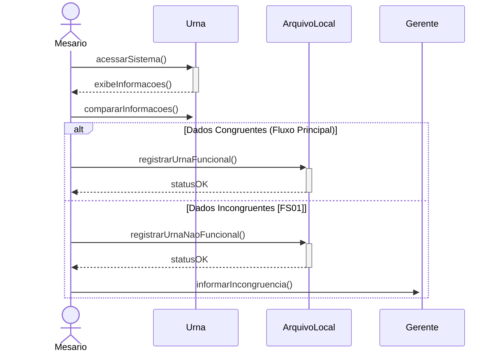
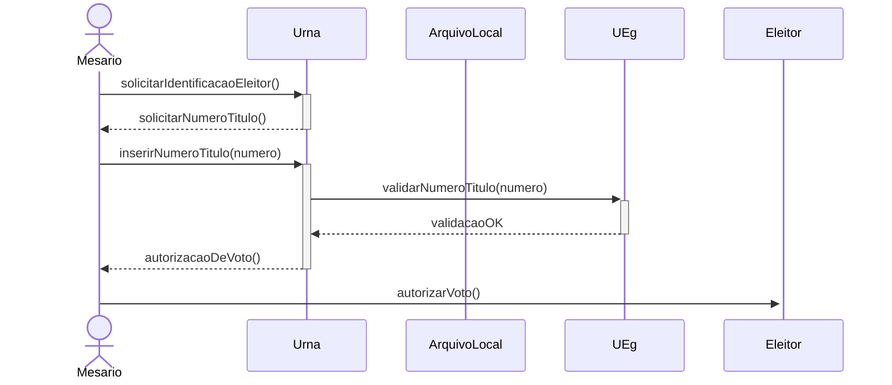
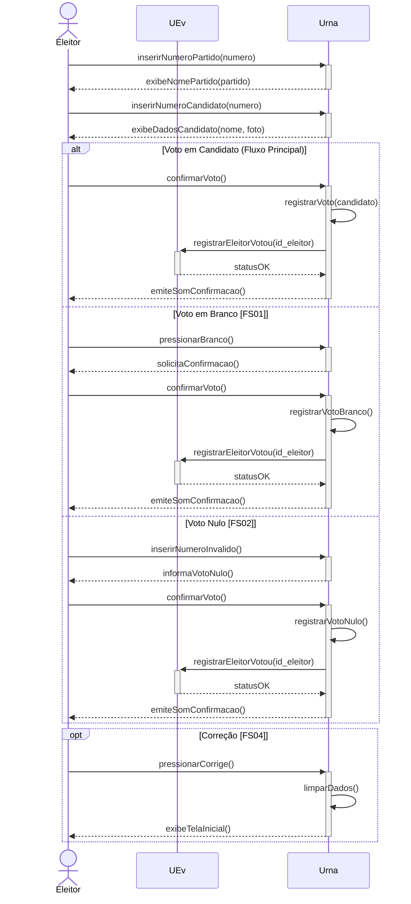

# UrnaEletronica
Projeto da aula modelagem de Software. 

Integrantes:
 - Sebastian Citta 24.123.068-9
 - Juan Manuel Citta 24.123.022-6
 - João Pedro Bazoli Palma 24.123.041-6

 

 

| Identificação | UC - 01 |
|---|---|
| Função | Cadastrar a Urna | 
| Atores | Gerente | 
| Prioridade | Essencial | 
| Pré-Condição | Urna em estado funcional | 
| Pós-Condição | Urna terá as informações cadastradas nela e está pronta para ser enviada ao local de votação | 
| Fluxo Principal | * O gerente acessa o sistema da urna   * O gerente entra no módulo UEg   * O gerente seleciona região   * O gerente entra com ID de uma Urna da região   * O gerente carrega a Lista de Candidatos da Região na Urna    |

| Identificação  | UC-02 |
|---|---|
| Função | Gerar relatório | 
| Atores | Gerente | 
| Prioridade | Essencial | 
| Pré-Condição | Votação concluída | 
| Pós-Condição | Será gerado um relatório com os resultados da votação,   apresentando os detalhes em formato de tabela ou gráficos | 
| Fluxo Principal | * O gerente acessa o sistema   * O gerente entra no módulo UEg   * O gerente separa os resultados da votação por UEv   * O gerente totaliza os resultados   * O gerente seleciona o modo de exibição do relatório   * O gerente gera o relatório    |

| Identificação | UC - 03 |
|---|---|
| Função | Validação da Urna | 
| Atores | Mesário, Urna | 
| Prioridade | Essencial | 
| Pré-Condição | A urna estar cadastrada | 
| Pós-Condição | Urna estará pronta para uso na votação | 
| Fluxo Principal | * O mesário acessa o sistema da urna   * O mesário compara as informações da urna com as informações locais [FS01]   * O mesário registra a urna como funcional em seu arquivo local | 
| Fluxo Secundário [FS01] | * Os dados estão incongruentes com as informações do mesário   * O mesário registra a urna como não funcional em seu arquivo local e informa a gerência  | 

| Identificação | UC - 04 |
|---|---|
| Função | Confirmar número de identificação | 
| Atores | Eleitor, Mesário | 
| Prioridade | Essencial | 
| Pré-Condição | Deve haver uma urna validada no local | 
| Pós-Condição | O eleitor pode prosseguir com o processo para votar | 
| Fluxo Principal | * O eleitor se apresenta com documento de identificação para o mesário   * O mesário acessa o UEv   * O mesário insere o número de identificação do documento no sistema   * O sistema valida o número e registra o eleitor na UEv e na UEg com nome, número de documento e opcionalmente uma foto [FS01]     * O mesário informa ao eleitor qual urna deverá usar | 
| Fluxo Secundário [FS01] | * O sistema não reconhece o número inserido   * O mesário tenta conseguir outra forma de identificação   * Após três tentativas de inserir outra identificação o mesário pede ao eleitor para voltar com um número de identificação válido  |

| Identificação | UC - 05 |
|---|---|
| Função | Selecionar candidato | 
| Atores | Eleitor, Urna | 
| Prioridade | Essencial | 
| Pré-Condição | O eleitor deve possuir número de identificação validado e ter sido guiado a uma urna cadastrada e validada | 
| Pós-Condição | A urna conterá um candidato selecionado | 
| Fluxo Principal | * O eleitor ingressa na cabine onde se encontra a urna   * O eleitor insere o número do partido e a urna mostra o nome do partido atrelado ao número inserido [FS01, FS02, FS03, FS04]   * O eleitor prossegue inserindo o número do candidato, a urna mostra a foto e o nome do candidato   * O eleitor confirma o voto selecionado   * A urna registra o voto no candidato escolhido e registra separadamente que o eleitor já votou na UEv | 
| Fluxo Secundário [FS01] | * Eleitor aperta no botão "BRANCO" sem haver inserido nenhum número   * A urna informa que o voto será em branco e pede para o eleitor apertar o botão "CONFIRMA"   * A urna registra o voto em branco e registra separadamente que o eleitor já votou na UEv | 
| Fluxo Secundário [FS02] | * Eleitor insere um número não registrado a nenhum partido   * A urna informa que o voto será nulo e pede para o eleitor apertar o botão "CONFIRMA"   * A urna registra o voto nulo e registra separadamente que o eleitor já votou na UEv | 
| Fluxo Secundário [FS03] | * Eleitor insere apenas o número do partido e aperta "CONFIRMA"   * A urna informa que o voto será de legenda e pede para o eleitor apertar o botão "CONFIRMA" * A urna registra o voto de legenda e registra separadamente que o eleitor já votou na UEv | 
| Fluxo Secundário [FS04] | * Eleitor aperta no botão "CORRIGE"   * A urna apagará o número inserido | 

  
**Diagrama de Classes**
 

  
**Diagrama de Sequência**
 

**Diagrama de Estados**
 

